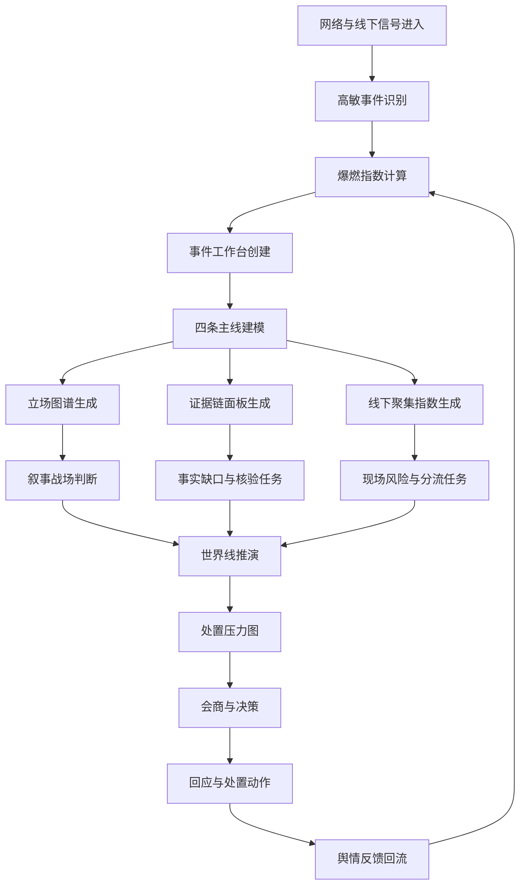

# 校园死亡事件高烈度社会风险 Story

日期：2026-05-02

适用场景：疑似校园欺凌、学生校内死亡、家属已知情、亲属/熟人共同体前往校方讨说法，并在短时间内引发网络热度与线下聚集风险。

## 1. 场景定位

这类事件不能按普通舆情事件处理。

它不是一个“发现事件、判断风险、生成回应”的线性流程，而是一个由死亡事实驱动的高烈度公共事件。事件会在极短时间内被家庭悲痛、校园责任争议、学生爆料、平台算法、公众正义感、地方治理压力共同推高。

系统的业务目标不是替代调查结论，也不是提前判断谁对谁错，而是在事实尚不完整、情绪已经爆燃、多方立场同时出现的情况下，帮助决策者看清：

```text
谁在说什么
谁相信什么
哪些证据缺失
哪些叙事正在占上风
哪些动作会激化矛盾
哪些处置窗口正在关闭
```

核心业务定义：

> 高烈度社会风险事件处置链：围绕死亡事实、责任归因、线下聚集、舆论爆燃和多方叙事争夺，提供信号发现、立场识别、证据组织、风险推演和处置协同能力。

## 2. 与普通舆情事件的差异

| 维度 | 普通舆情事件 | 校园死亡高烈度事件 |
| --- | --- | --- |
| 热度变化 | 逐步升温 | 短时间爆燃 |
| 核心驱动力 | 争议、投诉、体验不满 | 未成年人死亡事实 |
| 公众情绪 | 质疑、吐槽、愤怒 | 悲痛、愤怒、正义诉求、不信任 |
| 事实状态 | 可等待核实 | 事实未清但情绪先行 |
| 主体结构 | 发布者、被投诉方、围观者 | 家属、学校、学生、涉事方、教育部门、公安、属地、公众、媒体 |
| 线下风险 | 不一定存在 | 高概率存在家属聚集、围观、冲突、二次伤害 |
| 回应要求 | 解释即可缓和一部分 | 必须有可信动作和调查机制 |
| 系统重点 | 热度监测 | 多方立场、证据链、线下聚集、回应可信度 |

## 3. 多方立场结构

这类事件的关键不是只有“事件本身”，而是多方同时生成自己的叙事。

| 主体 | 典型关切 | 可能表达 | 系统需要识别的风险 |
| --- | --- | --- | --- |
| 家属 | 孩子为什么死亡，谁负责，学校是否隐瞒 | “孩子长期被欺负”“学校知道但不管”“必须给说法” | 悲痛转化为强烈问责，亲属聚集，拒绝空泛回应 |
| 亲属/熟人共同体 | 支持家属、形成共同压力 | “人已经过去了”“不能让孩子白没了” | 线下人数增加，现场冲突和围观扩大 |
| 校方 | 控制现场、等待调查、降低外部扩散 | “正在配合调查”“暂不方便透露” | 信息真空扩大，不信任上升 |
| 学生群体 | 恐惧、爆料、沉默、自保 | “之前确实有人欺负他”“我不敢说” | 匿名爆料、截图扩散、二次伤害 |
| 被指涉学生及家庭 | 避免被定性和网暴 | “不是霸凌，只是同学矛盾” | 个人信息泄露、网暴、对立升级 |
| 教育主管部门 | 事实调查、系统性责任、舆论压力 | “成立调查组”“依法依规处理” | 被卷入监管失职叙事 |
| 公安/属地 | 现场秩序、调查取证、冲突防控 | “依法调查”“维护现场秩序” | 聚集冲突、证据破坏、谣言扩散 |
| 公众 | 校园安全、未成年人保护、反霸凌 | “学校必须负责”“别再压事” | 情绪快速全国化，事件被泛化为制度问题 |
| 媒体/KOL | 追踪公共议题、放大典型案例 | “又一起校园欺凌悲剧？” | 议题跨平台扩散，责任叙事固化 |

## 4. 真实演化 Story

### 4.1 0-30 分钟：低可见度，高压事实已经形成

学生在校内坠亡。校方第一反应通常是封闭现场、通知家属、联系公安和教育主管部门。

此时外部网络上可能还没有明显信息，但校内学生群、家长群和本地熟人网络已经开始流动。

高风险信号包括：

- 学生群出现“之前被欺负”“老师知道”“昨天还发生过冲突”等说法。
- 家长群出现“学校出事了”“孩子没了”“别乱说”等内容。
- 校门口出现警车、救护车、围观学生或家属。
- 学校开始临时调整上下课、封闭区域、限制拍摄。

系统判断：

```text
网络低热度不等于低风险。
死亡事实一旦确认，事件已经进入高压状态。
```

### 4.2 30-90 分钟：家属到场，事件从内部事故变成对校方问责

家属赶到学校后，情绪不是普通维权，而是强烈的悲痛、愤怒和追责。

家属不会接受简单的“正在调查”，他们最关心：

- 谁欺负了孩子。
- 学校和班主任知不知道。
- 之前反映过没有。
- 监控在哪里。
- 孩子最后接触了谁。
- 为什么没有及时干预。
- 谁承担责任。

如果家属通知亲属、同乡、族亲、熟人前往学校，事件会从“家庭与学校的纠纷”转为“熟人共同体对校方的集体问责”。

系统判断：

```text
线下聚集风险开始形成。
此时最重要的不是发通稿，而是分流家属、保全证据、建立可信沟通机制。
```

### 4.3 1-3 小时：第一批视频出现，平台算法放大情绪

第一条短视频可能只有十几秒：校门口哭喊、家属质问、警车、救护车、拉横幅、学生围观。

视频画面不完整，但情绪强烈。只要标题或评论里出现“校园霸凌”“孩子没了”“学校不管”，热度可能迅速被平台推高。

系统需要识别的不是单条视频的真假，而是传播结构：

- 是否出现明确学校名称。
- 是否出现孩子照片、姓名、班级。
- 是否出现疑似涉事学生身份。
- 是否出现家属哭诉长视频。
- 是否出现“大家去学校”“帮忙转发”等动员语言。
- 是否从同城流量进入全国情绪场。

系统判断：

```text
事件进入爆燃前窗口。
此时每 10-30 分钟都可能改变事件走向。
```

### 4.4 3-6 小时：叙事分裂，多版本事实同时竞争

此时至少会出现五类叙事：

1. 家属叙事：孩子长期遭受校园暴力，学校和老师知道但没有有效处理，最终导致死亡。
2. 校方叙事：事件正在调查，目前不能定性，学校配合相关部门处理。
3. 学生叙事：有人爆料、有人沉默、有人自保、有人反驳。
4. 被指涉方叙事：不是霸凌，是普通同学矛盾，不能被网暴。
5. 公众叙事：孩子没了，学校必须给说法。

系统不能把这些说法混成一个“情绪负面”。它必须识别：

- 哪个叙事正在成为主线。
- 哪个叙事有证据支撑。
- 哪个叙事正在引发新一轮传播。
- 哪个叙事正在制造对立。
- 哪个叙事会触发线下冲突。

系统判断：

```text
事实调查尚未完成，但叙事主线已经开始固化。
如果官方动作跟不上，公众会用已有碎片自行补全故事。
```

### 4.5 6-24 小时：回应可信度决定事件走向

如果官方只发布“正在调查”，通常不足以稳定情绪。

公众和家属要看的不是流程存在，而是可信动作：

- 是否成立联合调查组。
- 是否封存监控。
- 是否保护聊天记录、投诉记录、报警记录。
- 是否安排独立沟通机制。
- 是否保护未成年人隐私。
- 是否暂停相关责任人员参与调查。
- 是否明确下一次信息发布时间。

系统需要对回应进行可信度评估：

| 回应动作 | 可能效果 | 风险 |
| --- | --- | --- |
| 只说正在调查 | 短期提供程序说明 | 容易被认为敷衍、拖延 |
| 说明联合调查组构成 | 提升程序可信度 | 如果成员全是校方相关，仍会被质疑 |
| 明确保全证据 | 回应家属核心担忧 | 如果后续证据缺失，会反噬 |
| 公开时间表 | 降低信息真空 | 时间表不能兑现会激化 |
| 过早否认欺凌 | 可能保护被指涉方 | 极易引发家属和公众反弹 |
| 过早认定欺凌 | 满足部分公众期待 | 可能损害调查公正和未成年人权益 |

系统判断：

```text
回应不是文本问题，而是可信动作问题。
文本只能解释动作，不能替代动作。
```

## 5. 四条主线建模

### 5.1 事实主线

回答“到底发生了什么”。

关键问题：

- 学生死亡是否属实。
- 发生地点和时间是什么。
- 是否发生在校内。
- 是否有抢救和报警记录。
- 是否存在长期欺凌。
- 家长此前是否反馈过。
- 学校是否有处置记录。
- 是否有监控、聊天记录、同学证言、教师记录。

输出：

- 事实时间轴。
- 已确认事实。
- 待核验事实。
- 矛盾说法。
- 证据缺口。

### 5.2 责任主线

回答“公众正在把责任指向谁”。

可能责任对象：

- 涉事学生。
- 班主任。
- 学校管理层。
- 心理老师或德育部门。
- 教育主管部门。
- 家庭沟通机制。
- 校园欺凌治理制度。

输出：

- 责任归因热度。
- 责任对象变化。
- 责任是否从个人转向机构。
- 是否出现系统性质疑。

### 5.3 情绪主线

回答“情绪为什么会升温”。

高危情绪：

- 悲痛。
- 愤怒。
- 同情。
- 不信任。
- 对未成年人保护失望。
- 对学校压事的怀疑。
- 对校园欺凌长期无解的集体愤怒。

输出：

- 情绪强度。
- 情绪结构。
- 情绪触发词。
- 情绪是否转向极端表达。

### 5.4 线下主线

回答“网络风险是否正在转为现实行动”。

关键指标：

- 家属人数是否增加。
- 是否有亲属持续赶到。
- 是否有围堵校门、拉横幅、喊话、直播。
- 是否有围观群众和媒体账号到场。
- 是否影响学校上课和学生安全。
- 是否出现冲突、推搡、过激言论。

输出：

- 线下聚集指数。
- 现场风险等级。
- 分流沟通建议。
- 保护未成年人和证据的优先任务。

## 6. 产品能力拆解

这类场景需要的不是普通事件卡，而是高烈度事件工作台。

### 6.1 爆燃指数

判断事件是否从局部信息进入高传播状态。

指标：

- 10 分钟、30 分钟、1 小时内容增速。
- 评论增速。
- 转发/分享增速。
- 同城扩散强度。
- 跨平台迁移。
- 情绪词突增。
- KOL/媒体介入。
- 动员语言出现。

### 6.2 立场图谱

把多方主体的说法分开，而不是混在一个摘要里。

主体：

- 家属。
- 亲属/熟人共同体。
- 校方。
- 学生。
- 被指涉方。
- 教育主管部门。
- 公安/属地。
- 公众。
- 媒体/KOL。

输出：

- 各方核心诉求。
- 各方公开表述。
- 各方信任对象。
- 各方冲突点。

### 6.3 叙事战场

识别“公众现在相信的是哪个版本”。

叙事类型：

- 校园欺凌导致死亡。
- 学校知情不作为。
- 学校试图压事。
- 普通同学矛盾被扩大。
- 个体心理问题。
- 教育系统长期失灵。

输出：

- 当前主导叙事。
- 上升叙事。
- 反向叙事。
- 证据支撑程度。
- 激化风险。

### 6.4 证据链面板

把证据和传言分开。

证据类型：

- 现场视频。
- 校门口视频。
- 家属陈述。
- 学生爆料。
- 聊天记录截图。
- 监控记录。
- 班主任沟通记录。
- 家长反馈记录。
- 报警/医疗记录。
- 官方通报。

输出：

- 已固定证据。
- 待核验证据。
- 高传播传言。
- 缺失关键证据。
- 证据保全任务。

### 6.5 线下聚集指数

识别现实行动风险。

指标：

- 现场人数。
- 亲属是否持续到场。
- 是否出现直播。
- 是否出现围观和媒体账号。
- 是否有动员话术。
- 是否有冲突画面。
- 是否影响学校秩序。

### 6.6 回应可信度评估

评估官方动作是否足以回应核心疑问。

维度：

- 是否回应死亡事实。
- 是否回应校园欺凌指控。
- 是否回应家属此前反馈。
- 是否回应证据保全。
- 是否回应调查主体。
- 是否回应未成年人保护。
- 是否回应后续发布时间。

## 7. 业务流程



## 8. 关键预警规则

### 8.1 橙色预警

触发条件示例：

- 出现学生死亡或重伤线索。
- 出现明确学校名称。
- 出现校园欺凌相关指控。
- 家属已到校。
- 同城平台出现现场视频。
- 评论中出现“学校不管”“压事”“讨说法”等高频词。

### 8.2 红色预警

触发条件示例：

- 死亡事实基本确认。
- 家属亲属持续聚集。
- 出现拉横幅、围堵、直播、喊话。
- 出现孩子照片、班级、疑似涉事学生姓名等敏感信息。
- 出现跨平台传播和媒体/KOL介入。
- 官方回应被集中质疑。
- 出现“去学校”“一起转发”“不能让他们压下来”等动员语言。

### 8.3 紫色专项预警

适用于极高敏态势：

- 未成年人隐私大规模扩散。
- 被指涉学生遭遇网暴和身份曝光。
- 家属与校方或安保人员发生冲突。
- 事件从单校扩展为区域教育系统信任危机。
- 出现极端言论、模仿风险或二次伤害风险。

## 9. 处置任务模板

| 任务类型 | 任务目标 | 责任主体 | 系统输入 | 输出物 |
| --- | --- | --- | --- | --- |
| 事实核验 | 确认死亡事实、时间、地点、经过 | 公安、教育、学校 | 现场视频、报警记录、医疗记录 | 事实时间轴 |
| 证据保全 | 防止关键证据丢失 | 公安、学校、教育部门 | 监控、聊天记录、投诉记录 | 证据清单 |
| 家属沟通 | 降低对抗和不信任 | 属地、教育、学校 | 家属诉求、聚集人数 | 沟通纪要 |
| 现场稳控 | 防止聚集扩大和二次冲突 | 公安、属地、学校 | 线下聚集指数 | 现场处置方案 |
| 舆情监测 | 跟踪热度、叙事、情绪变化 | 宣传、网信、系统平台 | 平台内容、评论、热榜 | 舆情态势报告 |
| 回应准备 | 形成可信公开表述 | 教育、宣传、学校 | 事实缺口、核心质疑 | 对外回应稿 |
| 未成年人保护 | 控制隐私扩散和网暴 | 平台、网信、学校 | 敏感信息传播信号 | 隐私保护任务 |

## 10. 世界线推演模板

### 10.1 低风险路径

条件：

- 家属被引导到稳定沟通场所。
- 证据保全动作被确认。
- 联合调查机制明确。
- 第一份回应没有回避核心问题。
- 网络上没有出现强证据爆料。

可能结果：

- 热度进入观望期。
- 家属诉求从现场对抗转向调查等待。
- 公众关注点转向调查结果。

### 10.2 中风险路径

条件：

- 官方回应过于笼统。
- 家属继续在校门口停留。
- 学生爆料不断出现但证据不完整。
- 评论区质疑集中在“学校压事”。

可能结果：

- 事件从同城扩散到区域。
- 媒体和KOL介入。
- 学校和教育主管部门被持续追问。

### 10.3 高风险路径

条件：

- 出现疑似监控、聊天记录、遗书、家属长视频。
- 家属和现场人员发生冲突。
- 被指涉学生身份被曝光。
- 官方回应被认为否认、拖延或转移责任。
- 事件进入全国热榜。

可能结果：

- 事件成为全国校园欺凌公共议题。
- 地方教育系统信任危机扩大。
- 多部门被迫公开介入。
- 后续处置成本显著上升。

## 11. 系统输出物

这类事件进入系统后，应自动生成以下输出：

1. 高烈度事件卡。
2. 爆燃指数曲线。
3. 多方立场图谱。
4. 四条主线面板。
5. 证据链状态表。
6. 线下聚集指数。
7. 叙事战场分析。
8. 回应可信度评分。
9. 24小时、72小时世界线推演。
10. 会商材料和处置任务清单。

## 12. 产品页面落点

可映射到当前系统模块：

| 产品模块 | 在本场景中的作用 |
| --- | --- |
| 风险态势主控台 | 显示总体高敏等级、爆燃指数、线下聚集风险 |
| 数据源中心 | 接入短视频、微博、新闻、论坛、同城内容、官方通报 |
| 信号工厂 | 抽取死亡、欺凌、学校、家属、聚集、证据、回应等信号 |
| 事件管理 | 创建高烈度事件卡，持续更新事实与风险状态 |
| 主线构建器 | 拆分事实、责任、情绪、线下四条主线 |
| 世界线观察器 | 推演低、中、高风险路径 |
| Agent Council | 从家属、学校、公众、属地、法律等视角校准判断 |
| 决策简报 | 输出给领导、教育部门、宣传部门、现场处置方 |
| 处置任务台 | 分派核验、保全、沟通、回应、稳控任务 |
| 案例库 | 复盘升级节点、有效动作和失败动作 |

## 13. 产品边界与合规要求

必须明确边界：

- 不替代公安、教育主管部门和司法调查结论。
- 不在事实未核实前定性校园欺凌、刑责或具体责任人。
- 不传播未成年人姓名、照片、班级、家庭住址等敏感信息。
- 不追踪非公开群聊、私密账号和非公开个人数据。
- 不把单个学生、家长或教师做个人画像。
- 不下载、转存、分发平台视频原文件，优先保存官方链接、截图、摘要和证据索引。
- 不以“压热度”为目标，而以缩短信任真空、降低二次伤害和支持依法处置为目标。

## 14. 可复用一句话

这个场景的业务本质是：

> 一个未成年人死亡后，家属叙事、学校叙事、学生爆料、公众情绪和地方治理压力在数小时内碰撞。系统要做的不是简单监测热度，而是帮助决策者看清多方立场、证据缺口、叙事变化、线下风险和处置窗口。

产品能力落点：

```text
从“舆情监测”
升级为
“高烈度社会风险事件处置链”
```
