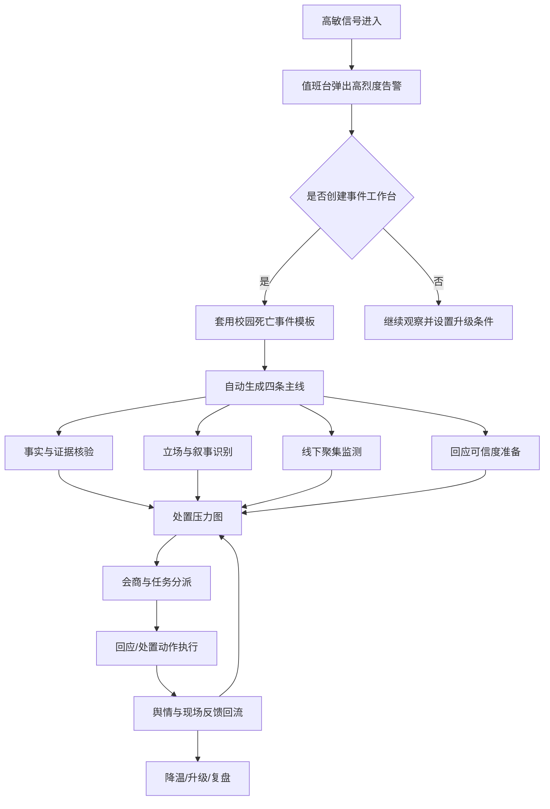

# 校园死亡高烈度事件用户使用场景与系统设计方案

日期：2026-05-02

关联文档：

- `docs/campus-death-high-intensity-event-story-20260502.md`
- `docs/network-data-business-capability-map-20260502.md`

## 1. 设计目标

这类事件中，用户面对的不是一个普通“舆情列表”，而是一个快速升温、事实未清、多方立场冲突、线下风险同步存在的高压处置场景。

系统设计目标：

```text
让用户在 30 秒内知道发生了什么；
在 3 分钟内知道风险为什么高；
在 10 分钟内组织起核验、证据、线下、回应四类任务；
在 30 分钟内形成第一版会商材料；
在整个处置过程中持续看见叙事、情绪、证据和现场风险的变化。
```

核心原则：

- 不让用户从空白页开始。
- 不把所有信息堆成大屏。
- 不把传言和事实混在一起。
- 不要求用户一次性填完整事件。
- 不用单一风险分数替代业务判断。
- 不以“发回应”为唯一目标，而是围绕事实、证据、立场、线下、回应做协同。

## 2. 目标用户与使用心理

### 2.1 值班监测员

典型状态：

- 同时盯多个平台和多个事件。
- 需要快速判断是否升级。
- 不一定掌握线下情况。

核心诉求：

- 哪条信号异常？
- 是否涉及死亡、未成年人、学校、家属聚集？
- 要不要立刻拉起事件工作台？

系统支持：

- 高敏信号自动置顶。
- 一键创建事件。
- 自动套用“校园死亡高烈度事件模板”。
- 自动提取学校、地点、死亡、欺凌、家属、聚集、爆料等关键词。

### 2.2 舆情研判员

典型状态：

- 需要把碎片信息整理成判断。
- 最怕事实不清、版本混乱。

核心诉求：

- 当前主流叙事是什么？
- 哪些说法有证据，哪些只是传言？
- 责任归因正在指向谁？
- 公众为什么不信任？

系统支持：

- 事实/传言/观点分栏。
- 立场图谱。
- 叙事战场。
- 证据链面板。
- 世界线推演。

### 2.3 现场联络员

典型状态：

- 需要同步现场人数、家属状态、校门口情况。
- 信息可能来自电话、微信、现场照片或简短文字。

核心诉求：

- 如何快速录入现场变化？
- 哪些现场状态会触发升级？
- 应该把信息同步给谁？

系统支持：

- 手机端轻量录入。
- 线下聚集指数。
- 现场事件时间轴。
- 一键标记“家属增加”“出现直播”“出现冲突”“需分流沟通”。

### 2.4 指挥/领导用户

典型状态：

- 时间少，需要快速掌握态势。
- 不会逐条看评论。
- 关注责任、风险、动作和后果。

核心诉求：

- 现在是什么级别？
- 最危险的变量是什么？
- 哪些事情必须马上做？
- 第一版材料怎么写？

系统支持：

- 领导摘要视图。
- 处置压力图。
- 三条世界线。
- 待决策事项。
- 会商简报自动生成。

### 2.5 宣传/回应口径人员

典型状态：

- 需要准备公开表述。
- 不能提前定性。
- 又不能空泛回应。

核心诉求：

- 公众最关心的三个问题是什么？
- 哪些话不能说？
- 哪些动作必须先完成，才能支撑回应？
- 当前回应是否可信？

系统支持：

- 核心质疑清单。
- 回应可信度评估。
- 风险表述提示。
- 第一版通报结构建议。

## 3. 总体产品结构

系统不应设计成单一大屏，而应设计成“事件工作台 + 分工协同”。

推荐一级导航：

```text
值班台
事件工作台
证据链
立场与叙事
线下风险
处置任务
会商简报
案例复盘
```

其中，高烈度事件发生时，用户不应该在多个菜单之间找入口，而是从告警直接进入“事件工作台”。

## 4. 关键业务流程



## 5. 页面设计方案

### 5.1 值班台：首页不是大屏，而是风险队列

用户进入系统第一眼应看到：

- 当前最高风险事件。
- 新增高敏信号。
- 过去 30 分钟爆燃信号。
- 待人工确认事件。
- 已进入处置中的事件。

页面结构：

```text
顶部：今日高敏概览
左侧：风险队列
中部：当前选中事件快速摘要
右侧：值班动作
底部：平台信号流
```

高烈度告警卡字段：

- 事件类型：校园死亡/疑似欺凌/家属聚集。
- 当前等级：红色或紫色。
- 爆燃指数：过去 30 分钟增长。
- 事实状态：死亡已确认/待确认。
- 线下状态：家属到校/亲属聚集/现场直播。
- 关键缺口：监控、投诉记录、官方回应。
- 推荐动作：创建事件工作台。

交互：

- 点击告警卡，不跳到详情长页，而是在右侧打开“快速判断抽屉”。
- 抽屉内只有三个主按钮：
  - 创建事件工作台
  - 加入已有事件
  - 继续观察
- 如果选择“继续观察”，必须选择升级条件，比如“出现学校名称”“出现家属视频”“评论过 500”“出现动员语言”。

### 5.2 事件工作台：主页面是处置中枢

事件工作台是核心页面。

推荐布局：

```text
固定顶部：事件状态条
左栏：时间轴与信号流
中栏：四条主线与当前判断
右栏：任务、缺口、下一步
底部：世界线与回应可信度
```

固定顶部状态条：

- 事件标题。
- 风险等级。
- 当前阶段：爆燃前 / 爆燃中 / 线下聚集中 / 回应后观察 / 降温 / 升级。
- 最近更新时间。
- 下一处置窗口：例如“距建议首轮会商剩 18 分钟”。
- 一键生成简报。

中栏四条主线：

1. 事实主线。
2. 责任主线。
3. 情绪主线。
4. 线下主线。

每条主线不使用长段文字，而用状态块：

- 已确认。
- 待核验。
- 正在升温。
- 关键缺口。
- 推荐动作。

右栏任务区：

- 核验死亡事实。
- 封存监控。
- 确认家属诉求。
- 核查此前投诉记录。
- 监测现场聚集。
- 准备第一版回应。

交互：

- 用户点击任何“待核验”项，可直接生成任务。
- 任务自动带上证据链接、上下文和建议责任部门。
- 任务完成后自动回写到对应主线。

### 5.3 证据链页面：事实、传言、观点必须分开

这个页面的目标是防止用户被信息淹没。

页面分三列：

```text
左列：已确认事实
中列：待核验证据
右列：高传播传言/观点
```

证据卡字段：

- 来源平台。
- 发布时间。
- 内容摘要。
- 证据类型：视频/截图/评论/通报/现场反馈。
- 可信度。
- 传播热度。
- 涉及主体。
- 是否含未成年人敏感信息。
- 处理状态：未看/已看/已核验/不采信/需保全。

交互：

- 拖拽证据卡到“已确认事实”时，必须选择确认来源。
- 标记“不采信”时，必须选择原因：来源不明、内容剪辑、时间不符、主体不符、重复传播。
- 对含未成年人隐私的证据，默认打码展示，只有授权角色可查看原始链接。

### 5.4 立场与叙事页面：让用户看见冲突结构

页面不应只显示情绪正负，而要显示“谁在说什么”。

核心组件：

- 立场图谱。
- 叙事排名。
- 责任归因变化。
- 核心质疑清单。
- 对立风险提示。

立场图谱节点：

- 家属。
- 亲属/熟人共同体。
- 校方。
- 学生。
- 被指涉方。
- 教育主管部门。
- 公安/属地。
- 公众。
- 媒体/KOL。

每个节点显示：

- 当前诉求。
- 代表性表达。
- 情绪强度。
- 信任对象。
- 冲突对象。
- 需要回应的问题。

叙事排名示例：

| 排名 | 叙事 | 趋势 | 证据支撑 | 风险 |
| --- | --- | --- | --- | --- |
| 1 | 学校知情不作为 | 上升 | 中 | 极高 |
| 2 | 校园欺凌导致死亡 | 上升 | 中 | 极高 |
| 3 | 学校试图压事 | 快速上升 | 低-中 | 极高 |
| 4 | 普通同学矛盾被扩大 | 平稳 | 低 | 中 |

交互：

- 点击一个叙事，系统展示支撑它的内容、反驳它的内容、证据缺口。
- 用户可以把某个叙事标记为“重点监控”。
- 当重点叙事突然上升，系统自动提醒。

### 5.5 线下风险页面：为现场处置服务

线下风险页要适合现场联络员和指挥用户共同使用。

核心区域：

- 学校位置与周边敏感点。
- 现场人数变化。
- 家属状态。
- 围观/直播状态。
- 是否影响学生安全和学校秩序。
- 现场任务。

现场状态快速录入：

```text
家属已到场
亲属继续增加
出现直播
出现拉横幅
出现围堵
出现冲突
已分流沟通
现场秩序稳定
```

交互：

- 手机端以大按钮为主，减少打字。
- 每次状态变化自动生成时间轴。
- 现场上传图片或文字后，默认进入“内部资料”，不直接进入公开证据链。
- 如果出现“冲突”“围堵”“直播扩散”，自动把事件阶段切换为“线下聚集中”。

### 5.6 处置任务页面：任务必须围绕主线组织

任务不能只是普通待办列表。

应按四条主线分组：

- 事实核验任务。
- 证据保全任务。
- 线下稳控任务。
- 回应准备任务。

任务字段：

- 任务名。
- 关联主线。
- 触发原因。
- 责任部门/责任人。
- 截止时间。
- 当前状态。
- 所需证据。
- 完成后影响哪个判断。

交互：

- 从“证据缺口”一键生成任务。
- 从“线下风险”一键生成现场任务。
- 从“核心质疑”一键生成回应准备任务。
- 任务完成后，系统提示是否更新事件判断。

### 5.7 会商简报页面：不是报告编辑器，而是决策材料生成器

用户需要的是 5 分钟内可用的会商材料。

简报结构：

1. 当前结论。
2. 已确认事实。
3. 待核验问题。
4. 主要叙事。
5. 线下风险。
6. 三条世界线。
7. 必须立即决策的事项。
8. 建议公开回应边界。

交互：

- 用户可以选择“给领导看”“给现场看”“给宣传口看”三种版本。
- 系统自动隐藏不适合外发的信息。
- 简报中每个判断都可展开查看证据来源。
- 导出时保留版本号和生成时间。

## 6. 关键交互设计

### 6.1 一键升级为高烈度事件

触发条件：

- 未成年人死亡。
- 学校场景。
- 疑似欺凌。
- 家属到校。
- 线下聚集。
- 平台热度快速上升。

用户点击“一键升级”后，系统自动完成：

- 创建事件工作台。
- 套用高烈度模板。
- 生成四条主线。
- 创建初始任务。
- 打开会商倒计时。
- 通知相关角色。

### 6.2 所有判断都带证据来源

系统界面中不应出现孤立结论。

错误示例：

```text
风险等级：高
```

正确示例：

```text
风险等级：高
原因：
1. 涉及未成年人死亡
2. 家属已到校
3. 评论中“学校压事”快速上升
4. 出现现场视频
5. 学校尚未公开说明调查机制
```

交互：

- 点击原因可查看对应证据。
- 如果证据被判定不采信，风险原因自动重新计算。

### 6.3 信任真空倒计时

这类事件中，沉默本身会增加风险。

系统应提供“信任真空倒计时”：

- 事件首次公开曝光时间。
- 家属公开视频时间。
- 官方首次回应时间。
- 距建议下一次信息更新剩余时间。

这不是强迫立刻发通告，而是提醒用户：

```text
如果没有事实更新，也需要给出调查机制、证据保全和下一次更新时间。
```

### 6.4 事实未清状态设计

系统必须允许“不确定”存在。

字段状态：

- 已确认。
- 高可信。
- 待核验。
- 存在争议。
- 已排除。

不要强迫用户把所有信息标成真或假。

### 6.5 高敏信息保护

涉及未成年人时，界面默认保护：

- 姓名打码。
- 照片打码。
- 班级打码。
- 家庭住址隐藏。
- 涉事学生身份隐藏。
- 原始视频需授权查看。

交互：

- 用户查看原始敏感信息时需要二次确认。
- 系统记录审计日志。
- 导出简报默认不包含敏感个人信息。

## 7. 用户完整使用场景

### 7.1 发现阶段

值班员在首页看到红色告警：

```text
某中学相关短视频 20 分钟内新增 38 条评论
关键词：学生坠楼、校园霸凌、家属到校、讨说法
系统建议：创建高烈度事件工作台
```

值班员点击告警，右侧抽屉展示：

- 首发视频。
- 涉及地点。
- 关键评论。
- 热度变化。
- 系统识别出的高敏标签。

值班员点击“创建事件工作台”。

### 7.2 初判阶段

系统自动进入事件工作台。

顶部显示：

```text
事件阶段：爆燃前窗口
风险等级：红色
事实状态：死亡待确认
线下状态：家属疑似到校
下一处置窗口：建议 30 分钟内完成首次会商
```

系统自动生成四条主线。

研判员首先处理“事实主线”，把死亡事实、学校名称、家属到校、欺凌指控分别标记为不同可信度。

### 7.3 协同阶段

系统提示三个关键缺口：

- 是否死亡属实。
- 是否有家属此前反馈记录。
- 是否已保全监控。

用户点击每个缺口，生成任务：

- 给现场联络员：确认家属人数和状态。
- 给教育部门：核查学校此前处理记录。
- 给公安/学校：确认监控保全。

任务分派后，右栏持续显示进度。

### 7.4 爆燃阶段

一小时后，系统检测到：

- 新增两条现场视频。
- 评论中“学校压事”上升。
- 出现疑似聊天记录截图。
- 有账号号召“去学校门口”。

系统把事件阶段改为：

```text
爆燃中 + 线下聚集风险
```

页面不弹出大量打断式弹窗，而是在顶部状态条出现红色变化，并把“线下主线”和“叙事战场”自动置顶。

### 7.5 会商阶段

指挥用户进入系统，只看领导视图。

页面展示：

- 当前一句话结论。
- 三个最大风险。
- 三个事实缺口。
- 三个必须马上做的动作。
- 三条未来路径。

指挥用户点击“生成会商简报”。

系统生成第一版材料，并标注：

```text
以下判断基于公开网络信号和现场回传，不替代正式调查结论。
```

### 7.6 回应后观察阶段

官方发布第一版说明后，系统自动监测：

- 评论是否接受。
- “敷衍”“压事”“不信”等词是否下降。
- 家属是否继续发布视频。
- KOL 是否继续跟进。
- 线下是否降温。

系统给出回应可信度：

```text
回应可信度：中低
原因：
1. 说明调查存在，但没有说明证据保全
2. 未回应家属此前是否反馈
3. 没有下一次信息更新时间
4. 评论区质疑仍在上升
```

系统建议补充动作，而不是只建议再发一篇通稿。

## 8. 信息架构与字段设计

### 8.1 事件对象

```text
event_id
event_type
event_title
risk_level
event_stage
school_name
location
first_seen_at
first_public_video_at
official_response_at
death_status
bullying_claim_status
family_arrival_status
offline_gathering_status
trust_gap_timer
```

### 8.2 信号对象

```text
signal_id
platform
source_url
published_at
captured_at
content_summary
content_type
evidence_type
related_actor
stance
narrative
emotion
credibility
spread_score
privacy_risk
verification_status
```

### 8.3 主线对象

```text
mainline_id
mainline_type
current_state
confirmed_points
open_questions
conflicting_claims
evidence_refs
risk_drivers
recommended_tasks
```

### 8.4 任务对象

```text
task_id
task_type
related_mainline
trigger_reason
owner_role
owner_name
deadline
status
required_inputs
completion_effect
audit_log
```

## 9. 视觉与界面风格建议

这不是营销页，也不是炫技大屏。界面应当像“高压事件指挥工作台”。

视觉原则：

- 高密度但不拥挤。
- 少用装饰，更多用线条、分区、状态色。
- 数字和时间使用等宽字体。
- 风险色只用于真正需要注意的位置。
- 不用大面积红色背景，避免用户疲劳。
- 证据、任务、主线用清晰标签区分。

颜色建议：

- 基础：深色工作台或低饱和浅色工作台均可。
- 风险色：橙、红、深红分级。
- 可信度：绿、黄、红。
- 状态：蓝色表示处理中，灰色表示待确认。

组件建议：

- 顶部固定状态条。
- 右侧任务抽屉。
- 左侧信号时间轴。
- 中央主线面板。
- 可折叠证据卡。
- 分段控制切换：事实 / 责任 / 情绪 / 线下。
- 时间窗口选择：近 10 分钟 / 30 分钟 / 1 小时 / 24 小时。

## 10. MVP 版本设计

第一阶段不需要把所有能力都做满。

### 10.1 必做

- 高敏事件模板。
- 值班台风险队列。
- 事件工作台。
- 四条主线。
- 证据链三分栏。
- 处置任务。
- 会商简报。

### 10.2 可后置

- 自动立场图谱。
- 复杂世界线概率模型。
- 全自动回应可信度评分。
- 地图级现场态势。
- 多平台账号级传播网络。

### 10.3 第一版成功标准

用户在真实事件中能够：

- 快速创建事件。
- 不混淆事实和传言。
- 看清多方立场。
- 分派关键任务。
- 生成第一版会商材料。
- 持续观察回应后的变化。

## 11. 设计重点总结

这个系统的核心不是“把数据展示出来”，而是让用户在高压、不完整、快速变化的情况下能够顺畅完成判断和协同。

最终体验应该是：

```text
用户看到告警，不需要思考从哪里开始；
进入事件，不需要手工搭结构；
看到信息，不会混淆事实、传言和观点；
发现缺口，可以一键变成任务；
准备会商，可以自动形成材料；
回应之后，可以知道公众是否接受；
事件结束，可以复盘哪些动作有效。
```

产品主张：

> 从“看见舆情”升级为“组织处置”。

