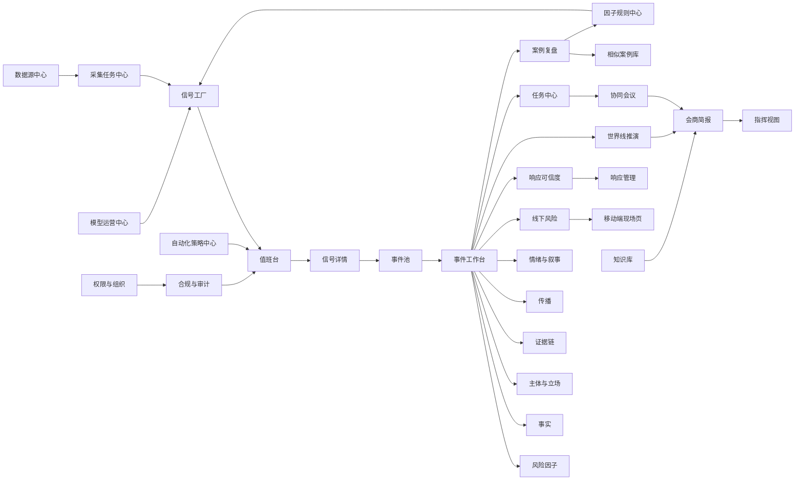

# 因子驱动风险事件系统全量产品设计方案

日期：2026-05-02

关联文档：

- `docs/general-event-factor-driven-system-design-20260502.md`
- `docs/factor-driven-page-design-20260502.md`
- `docs/network-data-business-capability-map-20260502.md`

## 1. 全量设计立场

本方案不按 MVP 收敛，而按完整业务系统设计。

系统目标不是做一个“舆情监测页面集合”，而是建设一套覆盖全链路的风险事件操作系统：

```text
数据接入
→ 信号抽取
→ 风险因子识别
→ 事件聚合
→ 证据链管理
→ 主体与叙事建模
→ 传播与线下风险判断
→ 世界线推演
→ 会商协同
→ 任务处置
→ 响应评估
→ 案例复盘
→ 规则与模型回流
```

完整系统不以事件类型为核心，而以风险因子为核心。事件类型只是辅助分类，真正驱动页面、流程、任务和推演的是因子组合。

## 2. 全量业务对象

完整系统至少包含 16 类核心业务对象。

| 对象 | 说明 |
| --- | --- |
| DataSource | 数据源，包含平台、接口、采集方式、合规等级、健康状态 |
| RawItem | 原始采集内容，保留原始链接、采集时间、原始结构 |
| Signal | 标准化信号，从 RawItem 中抽取出的可分析单元 |
| RiskFactor | 风险因子，系统判断和流程编排的核心单元 |
| Event | 事件，由多个信号和因子聚合形成 |
| Evidence | 证据项，用于支撑事实、叙事、责任或响应判断 |
| Actor | 主体，包括当事人、机构、部门、群体、媒体、平台等 |
| Stance | 主体立场，描述主体诉求、表述、冲突对象和信任对象 |
| Narrative | 叙事，描述公众如何理解事件 |
| Emotion | 情绪结构，描述愤怒、恐惧、同情、不信任等 |
| Propagation | 传播结构，描述平台、节点、迁移、爆燃和扩散路径 |
| OfflineState | 线下状态，描述聚集、现场、冲突、秩序和现实影响 |
| Response | 响应动作，包括官方、机构、企业、平台或现场回应 |
| Task | 处置任务，连接判断与行动 |
| Brief | 会商简报和决策材料 |
| Case | 复盘案例，用于规则、模型和经验沉淀 |

## 3. 全量用户角色

系统需要支持多角色并行，而不是只服务单一研判员。

| 角色 | 核心问题 | 默认首页 |
| --- | --- | --- |
| 值班监测员 | 现在有什么异常？要不要升级？ | 值班台 |
| 数据运营员 | 哪些源可用？采集是否异常？ | 数据源中心 |
| 信号标注员 | 抽取是否准确？是否误报？ | 信号工厂 |
| 舆情研判员 | 事件主线、叙事、情绪如何变化？ | 事件工作台 |
| 证据管理员 | 哪些材料可采信？哪些需保护？ | 证据链 |
| 现场联络员 | 现场状态如何？是否需要支援？ | 移动端现场页 |
| 部门协同员 | 哪些任务归我？何时完成？ | 任务中心 |
| 宣传回应人员 | 公众质疑是什么？回应是否可信？ | 响应可信度 |
| 指挥/领导 | 当前结论、风险和决策点是什么？ | 指挥视图 |
| 规则管理员 | 因子规则是否有效？是否需要调整？ | 因子规则中心 |
| 模型管理员 | 模型抽取、分类、推演效果如何？ | 模型运营中心 |
| 合规审计员 | 是否存在越权查看、敏感外发？ | 审计中心 |
| 复盘分析员 | 哪些判断和动作有效？ | 案例复盘 |

## 4. 全量一级导航

全量系统建议一级导航如下：

```text
一、态势与值班
  1. 值班台
  2. 风险总览
  3. 事件池
  4. 指挥视图

二、事件研判
  5. 事件工作台
  6. 风险因子面板
  7. 事实面板
  8. 主体与立场
  9. 证据链
  10. 传播面板
  11. 情绪与叙事
  12. 线下风险
  13. 响应可信度
  14. 世界线推演

三、协同处置
  15. 任务中心
  16. 会商简报
  17. 协同会议
  18. 响应管理
  19. 移动端现场页

四、数据与智能
  20. 数据源中心
  21. 采集任务中心
  22. 信号工厂
  23. 实体库
  24. 因子规则中心
  25. 模型运营中心
  26. 自动化策略中心

五、知识与治理
  27. 案例复盘
  28. 相似案例库
  29. 知识库
  30. 合规与审计
  31. 权限与组织
  32. 系统管理
```

## 5. 全量页面设计

### 5.1 值班台

定位：系统的实时入口，负责发现异常和启动处置。

核心区域：

- 高敏风险队列。
- 爆燃信号队列。
- 待人工确认因子。
- 数据源异常提醒。
- 超时任务提醒。
- 近期新增事件。

关键动作：

- 打开信号详情。
- 确认风险因子。
- 创建事件。
- 并入已有事件。
- 设置观察条件。
- 分派初核任务。

### 5.2 风险总览

定位：跨城市、跨行业、跨事件的整体态势视图。

核心区域：

- 总体风险等级。
- 区域风险分布。
- 行业风险排行。
- 风险因子热力图。
- 爆燃事件趋势。
- 线下风险分布。
- 响应滞后事件。

关键动作：

- 切换城市、行业、专题。
- 下钻到事件池。
- 对比时间窗口。
- 查看风险因子来源。

### 5.3 事件池

定位：所有事件的管理入口。

核心区域：

- 事件列表。
- 阶段分组。
- 因子筛选。
- 风险等级筛选。
- 责任指向筛选。
- 响应状态筛选。
- 线下状态筛选。

关键动作：

- 进入事件工作台。
- 合并事件。
- 拆分事件。
- 降级/关闭事件。
- 批量分派复核。

### 5.4 指挥视图

定位：面向领导和指挥角色的极简高密度视图。

核心区域：

- 当前一句话结论。
- 最高风险事件。
- 三个最大风险变量。
- 三个必须马上决策事项。
- 线下风险状态。
- 响应窗口。
- 世界线摘要。

关键动作：

- 查看会商简报。
- 批示任务。
- 查看证据摘要。
- 启动会商。

### 5.5 事件工作台

定位：单个事件的总控页面。

核心区域：

- 事件上下文条。
- 事件时间轴。
- 七个通用面板概览。
- 主导风险因子。
- 缺口与任务。
- 世界线摘要。
- 响应状态。

关键动作：

- 修正因子。
- 进入专项面板。
- 从缺口生成任务。
- 生成简报。
- 启动推演。

### 5.6 风险因子面板

定位：解释系统为什么认为事件风险高。

核心区域：

- 当前触发因子。
- 因子分类。
- 因子置信度。
- 因子严重度。
- 触发证据。
- 触发模块和任务。
- 因子变化时间轴。

关键动作：

- 确认因子。
- 降级因子。
- 排除因子。
- 新增因子。
- 查看触发规则。

### 5.7 事实面板

定位：管理已确认事实、待核验事实和冲突说法。

核心区域：

- 事实确认度。
- 已确认事实。
- 待核验事实。
- 冲突说法。
- 事实时间轴。
- 核验任务。

关键动作：

- 升级为已确认。
- 标记存在争议。
- 创建核验任务。
- 关联证据。
- 刷新简报。

### 5.8 主体与立场

定位：识别事件中所有主体及其诉求和冲突关系。

核心区域：

- 主体列表。
- 立场图谱。
- 责任指向。
- 信任对象。
- 冲突对象。
- 主体发声时间轴。

关键动作：

- 标记需沟通主体。
- 查看主体相关信号。
- 生成主体沟通任务。
- 识别网暴或隐私风险。

### 5.9 证据链

定位：把证据、传言和观点分开管理。

核心区域：

- 已采信证据。
- 待核验证据。
- 高传播传言。
- 观点材料。
- 隐私风险材料。
- 证据保全任务。

关键动作：

- 采信。
- 不采信。
- 标记待核验。
- 打码保护。
- 生成保全任务。
- 加入简报。

### 5.10 传播面板

定位：判断事件传播速度、范围和爆燃状态。

核心区域：

- 爆燃指数。
- 平台分布。
- 热度曲线。
- 关键传播节点。
- 跨平台迁移路径。
- KOL/媒体介入。
- 话题词演化。

关键动作：

- 切换时间窗口。
- 查看传播节点。
- 设置爆燃阈值。
- 补采同主题内容。
- 标记关键节点。

### 5.11 情绪与叙事

定位：判断公众如何理解事件，以及哪种叙事正在占上风。

核心区域：

- 情绪结构。
- 叙事排名。
- 责任归因。
- 核心质疑。
- 对立风险。
- 叙事变化时间轴。

关键动作：

- 查看叙事证据。
- 标记重点叙事。
- 从质疑生成回应任务。
- 观察叙事反转。

### 5.12 线下风险

定位：判断网络情绪是否转化为现实行动。

核心区域：

- 线下风险等级。
- 地点与周边敏感点。
- 现场人数变化。
- 现场状态。
- 现场材料。
- 现场任务。
- 现场时间轴。

关键动作：

- 录入现场状态。
- 上传现场材料。
- 标记冲突/围堵/直播。
- 分派现场联络任务。
- 同步指挥视图。

### 5.13 响应可信度

定位：评估机构、官方或企业回应是否足以缩短信任真空。

核心区域：

- 信任真空时间轴。
- 核心质疑。
- 已有响应。
- 未回应问题。
- 高风险表述。
- 回应可信度。
- 下一次更新时间建议。

关键动作：

- 录入回应文本。
- 上传通报链接。
- 检查未回应问题。
- 生成回应准备任务。
- 观察回应后反馈。

### 5.14 世界线推演

定位：推演未来路径和关键变量。

核心区域：

- 推演时间窗口。
- 低/中/高风险路径。
- 关键触发变量。
- 观察指标。
- 建议动作。
- 历史相似案例。

关键动作：

- 调整假设变量。
- 重新推演。
- 将路径加入简报。
- 创建观察任务。
- 复盘命中情况。

### 5.15 任务中心

定位：把风险判断转成可执行动作。

核心区域：

- 我的任务。
- 事件任务。
- 超时任务。
- 部门任务。
- 任务状态。
- 任务关联证据。
- 任务完成影响。

关键动作：

- 接收任务。
- 转派任务。
- 更新状态。
- 上传结果。
- 回写事件判断。

### 5.16 会商简报

定位：快速生成不同对象可用的决策材料。

核心区域：

- 简报对象。
- 当前结论。
- 已确认事实。
- 待核验问题。
- 主导因子。
- 主要叙事。
- 线下风险。
- 响应状态。
- 世界线。
- 待决策事项。

关键动作：

- 生成初稿。
- 切换版本。
- 展开证据。
- 脱敏导出。
- 记录版本。

### 5.17 协同会议

定位：支持多部门会商过程。

核心区域：

- 会议议题。
- 参会角色。
- 当前材料。
- 待决策事项。
- 会议纪要。
- 决策转任务。

关键动作：

- 发起会议。
- 拉取事件材料。
- 标记决策。
- 一键生成任务。
- 保存会议纪要。

### 5.18 响应管理

定位：管理对外、对内、对现场的响应动作。

核心区域：

- 响应计划。
- 响应文本。
- 审核状态。
- 发布渠道。
- 发布时间。
- 回应后反馈。

关键动作：

- 起草回应。
- 合规检查。
- 提交审核。
- 记录发布。
- 评估效果。

### 5.19 移动端现场页

定位：现场人员低成本回传情况。

核心区域：

- 事件名称。
- 当前风险等级。
- 现场状态大按钮。
- 图片/文字/语音上传。
- 最近回传记录。

关键动作：

- 一键标记状态。
- 上传材料。
- 请求支援。
- 查看任务。
- 确认现场已稳定。

### 5.20 数据源中心

定位：管理所有数据来源及健康状态。

核心区域：

- 数据源分类。
- 接入方式。
- 成功率。
- 最近采集时间。
- 数据量。
- 合规等级。
- 异常原因。

关键动作：

- 开启/暂停数据源。
- 配置关键词。
- 查看采集样本。
- 处理异常。
- 查看合规说明。

### 5.21 采集任务中心

定位：管理定时采集、补采、专题采集和浏览器采集任务。

核心区域：

- 任务列表。
- 采集策略。
- 调度状态。
- 成功/失败记录。
- 采集样本。
- 异常日志。

关键动作：

- 新建采集任务。
- 配置频率。
- 配置关键词/地域/平台。
- 重试失败任务。
- 暂停高风险采集。

### 5.22 信号工厂

定位：从原始内容生成标准化 Signal。

核心区域：

- 原始内容队列。
- 抽取结果。
- 风险因子候选。
- 实体识别。
- 情绪/叙事识别。
- 质量检查。

关键动作：

- 人工校正抽取。
- 标记噪声。
- 加入事件。
- 触发补采。
- 反馈模型。

### 5.23 实体库

定位：管理学校、医院、企业、项目、地点、部门等实体。

核心区域：

- 实体列表。
- 实体类型。
- 别名。
- 关联事件。
- 关联风险因子。
- 位置和层级关系。

关键动作：

- 合并实体。
- 新增别名。
- 关联事件。
- 标记敏感主体。
- 维护组织层级。

### 5.24 因子规则中心

定位：配置风险因子识别、权重和触发动作。

核心区域：

- 因子库。
- 触发条件。
- 置信度规则。
- 严重度权重。
- 触发模块。
- 触发任务。
- 适用领域。
- 规则版本。

关键动作：

- 新增因子。
- 调整权重。
- 测试历史案例。
- 发布规则。
- 回滚规则。

### 5.25 模型运营中心

定位：管理抽取、分类、聚类、叙事识别、推演模型的效果。

核心区域：

- 模型列表。
- 任务类型。
- 准确率/召回率。
- 人工修正样本。
- 错误案例。
- 版本记录。

关键动作：

- 查看模型效果。
- 标记错误样本。
- 发起评估。
- 切换模型版本。
- 导出训练样本。

### 5.26 自动化策略中心

定位：管理系统自动动作。

核心区域：

- 自动创建事件规则。
- 自动升级规则。
- 自动通知规则。
- 自动生成任务规则。
- 自动补采规则。
- 自动降级规则。

关键动作：

- 配置策略。
- 模拟触发结果。
- 查看执行日志。
- 暂停策略。
- 回滚策略。

### 5.27 案例复盘

定位：把处置过程沉淀为经验。

核心区域：

- 事件复盘时间轴。
- 早期信号。
- 关键因子。
- 判断变化。
- 处置动作。
- 响应效果。
- 世界线命中情况。
- 规则优化建议。

关键动作：

- 生成复盘报告。
- 标记有效动作。
- 标记失败动作。
- 转为规则建议。
- 关联相似案例。

### 5.28 相似案例库

定位：帮助用户在新事件中找到历史参照。

核心区域：

- 相似案例列表。
- 相似原因。
- 关键因子对比。
- 演化路径对比。
- 处置动作对比。
- 结果对比。

关键动作：

- 加入当前事件参考。
- 查看历史简报。
- 复制观察指标。
- 提取处置经验。

### 5.29 知识库

定位：沉淀政策、规则、口径、处置经验。

核心区域：

- 政策法规。
- 处置指南。
- 口径边界。
- 风险案例。
- 部门职责。
- 专家意见。

关键动作：

- 搜索知识。
- 关联事件。
- 加入简报。
- 更新条目。
- 版本管理。

### 5.30 合规与审计

定位：保证数据使用、敏感信息和操作可追踪。

核心区域：

- 敏感信息访问记录。
- 导出记录。
- 账号操作记录。
- 规则修改记录。
- 人工修正记录。
- 数据源合规状态。

关键动作：

- 查询审计日志。
- 标记异常访问。
- 导出审计报告。
- 配置敏感字段策略。
- 配置保留期限。

### 5.31 权限与组织

定位：管理组织、角色、权限、可见范围。

核心区域：

- 组织架构。
- 用户角色。
- 数据权限。
- 页面权限。
- 事件权限。
- 敏感信息权限。

关键动作：

- 新增角色。
- 分配事件范围。
- 设置导出权限。
- 设置原始材料访问权限。
- 配置跨部门协同权限。

### 5.32 系统管理

定位：系统级配置。

核心区域：

- 全局参数。
- 字典管理。
- 消息通知。
- 外部系统接入。
- 存储策略。
- 备份策略。

关键动作：

- 配置通知渠道。
- 配置数据保留。
- 配置外部接口。
- 查看系统状态。

## 6. 全量跨页面能力

### 6.1 全局搜索

支持搜索：

- 事件。
- 信号。
- 证据。
- 主体。
- 因子。
- 任务。
- 简报。
- 案例。
- 知识条目。

搜索结果必须显示来源、状态、可信度和权限边界。

### 6.2 全局时间轴

所有事件都共享时间轴能力：

- 首次信号。
- 首次爆燃。
- 首次官方响应。
- 关键证据出现。
- 线下状态变化。
- 任务完成。
- 简报生成。
- 风险升级/降级。

### 6.3 全局证据溯源

任何判断都必须能回溯：

```text
判断
→ 相关因子
→ 相关信号
→ 证据项
→ 原始来源
→ 操作记录
```

### 6.4 全局脱敏

导出、简报、外发、截图时自动检查：

- 未成年人信息。
- 个人电话。
- 身份证。
- 住址。
- 医疗隐私。
- 涉事个人头像/姓名。
- 内部处置意见。

### 6.5 全局版本

以下对象需要版本：

- 会商简报。
- 事件判断。
- 因子规则。
- 响应文本。
- 世界线推演。
- 案例复盘。
- 模型版本。

## 7. 全量页面关系



## 8. 全量系统的三条主体验链路

### 8.1 值班到处置链路

```text
值班台
→ 信号详情
→ 因子确认
→ 创建事件
→ 事件工作台
→ 任务中心
→ 会商简报
→ 响应管理
→ 回应后观察
```

### 8.2 数据到智能链路

```text
数据源中心
→ 采集任务中心
→ 信号工厂
→ 因子识别
→ 事件聚合
→ 模型运营中心
→ 因子规则中心
→ 自动化策略中心
```

### 8.3 复盘到优化链路

```text
案例复盘
→ 相似案例库
→ 有效动作沉淀
→ 失败动作沉淀
→ 因子权重调整
→ 任务策略优化
→ 模型样本回流
```

## 9. 全量设计验收标准

全量系统应满足：

- 任意事件不依赖固定模板即可进入工作台。
- 任意判断都能追溯到证据和原始来源。
- 任意风险因子都能解释触发原因、影响模块和任务。
- 任意处置任务都能说明由哪个缺口或因子触发。
- 任意简报都能自动脱敏、保留版本和证据引用。
- 任意事件结束后都能复盘为规则、案例和模型样本。
- 任意角色看到的是自己需要完成的动作，而不是完整系统复杂度。

## 10. 最终产品定义

全量产品不是：

```text
舆情监测大屏
```

也不是：

```text
事件模板库
```

而是：

```text
因子驱动的风险事件操作系统
```

它的核心能力是：

```text
用网络与现场信号发现风险；
用风险因子解释风险；
用证据链约束判断；
用主体和叙事理解冲突；
用任务和会商组织处置；
用世界线推演未来；
用复盘持续优化系统。
```

