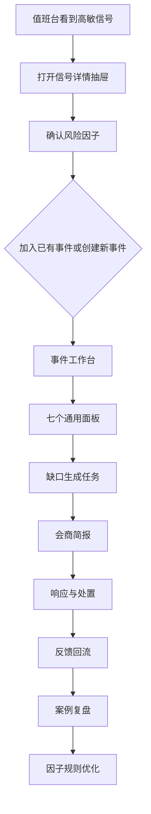
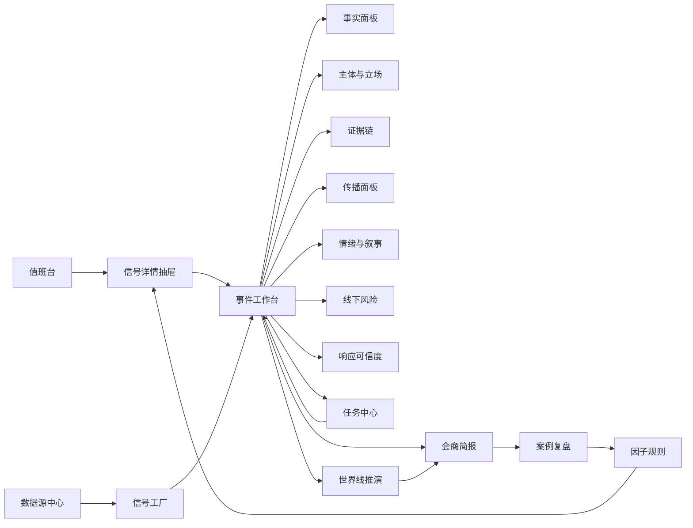

# 因子驱动风险事件系统页面设计方案

日期：2026-05-02

关联文档：

- `docs/general-event-factor-driven-system-design-20260502.md`
- `docs/campus-high-intensity-event-ux-business-design-20260502.md`
- `docs/network-data-business-capability-map-20260502.md`

## 1. 页面设计总叙事

系统不围绕“校园暴力模板、医疗纠纷模板、文旅投诉模板”来设计页面，而围绕一个通用处置叙事设计：

```text
网络信号进入
→ 系统识别风险因子
→ 用户确认/修正因子
→ 创建或更新事件
→ 七个通用面板组织判断
→ 因子触发任务和角色协同
→ 形成会商材料和响应建议
→ 处置结果回流
→ 案例复盘和因子规则优化
```

页面设计的核心目标：

- 让用户先看见风险因子，而不是先选择事件模板。
- 让用户一直知道哪些是事实、哪些是传言、哪些是观点。
- 让用户每看到一个缺口，都能立刻转成任务。
- 让系统根据因子动态置顶模块，而不是让用户自己找页面。
- 让每个判断都有证据来源、可信度和更新时间。

## 2. 全局信息架构

一级导航建议：

```text
值班台
事件工作台
信号工厂
证据链
任务中心
会商简报
世界线推演
案例复盘
数据源中心
因子规则
系统管理
```

不是所有角色都看到完整导航。高压处置角色优先看到“值班台、事件工作台、任务中心、会商简报”；配置类角色才看到“数据源中心、因子规则、系统管理”。

## 3. 全局布局规则

### 3.1 顶部全局状态条

所有核心页面顶部固定一条状态栏。

内容：

- 当前专题/城市/行业。
- 数据更新时间。
- 数据健康状态。
- 当前最高风险事件。
- 待处理任务数。
- 当前用户角色。

交互：

- 点击最高风险事件，直接进入该事件工作台。
- 点击数据健康，打开数据源异常抽屉。
- 点击待处理任务，打开个人任务抽屉。

### 3.2 事件上下文条

进入某个事件后，顶部增加事件上下文条。

内容：

- 事件标题。
- 当前阶段。
- 风险等级。
- 主导风险因子。
- 最近新增信号。
- 信任真空倒计时。
- 下一建议动作。

交互：

- 点击风险因子，展开因子来源和触发规则。
- 点击信任真空，查看关键时间节点。
- 点击下一建议动作，直接生成任务或进入会商。

### 3.3 右侧动作栏

核心业务页面统一保留右侧动作栏。

内容：

- 当前页面待处理缺口。
- 推荐任务。
- 需要人工确认的判断。
- 相关角色协同入口。

好处：

- 用户不用离开当前页面就能派任务。
- 系统把“看见问题”和“组织处置”连在一起。

### 3.4 通用状态标签

所有页面统一使用以下状态：

```text
已确认
高可信
待核验
存在争议
已排除
已过期
需保护
需会商
```

避免每个页面各写一套状态词，降低用户理解成本。

## 4. 用户主路径



## 5. 页面一：值班台

### 用户目标

用户进入系统后，第一时间知道：

- 现在最危险的事件是什么。
- 哪些新信号值得看。
- 哪些事件正在爆燃。
- 哪些任务已经超时。

### 首屏布局

```text
顶部：全局状态条
左侧：高敏风险队列
中部：当前选中风险快照
右侧：值班动作栏
底部：实时信号流
```

### 核心组件

高敏风险队列：

- 事件标题或信号摘要。
- 风险等级。
- 识别到的风险因子。
- 爆燃速度。
- 线下风险状态。
- 最近更新时间。

当前风险快照：

- 一句话判断。
- 已确认事实。
- 待核验缺口。
- 主要叙事。
- 传播趋势。
- 推荐动作。

值班动作栏：

- 创建事件。
- 加入已有事件。
- 设置观察条件。
- 分派初核任务。

### 关键交互

- 点击风险卡片，右侧打开详情抽屉，不直接跳页。
- 点击“确认因子并创建事件”，进入事件工作台。
- 点击“继续观察”，必须设置升级条件。
- 用户可以把误报标为“已排除”，系统记录原因。

### 空状态

没有高敏事件时，展示：

- 当前监测范围。
- 数据源健康。
- 最近一次采集时间。
- 建议补充的关键词或平台。

## 6. 页面二：高敏信号详情抽屉

### 用户目标

在不离开值班台的情况下判断：

- 这条信号是否值得升级。
- 系统识别的风险因子是否正确。
- 它属于已有事件，还是要创建新事件。

### 布局

```text
上部：原始信号摘要
中部：风险因子识别
下部：相似事件匹配
底部：动作按钮
```

### 核心组件

原始信号摘要：

- 平台。
- 发布时间。
- 内容摘要。
- 原始链接。
- 截图/封面。
- 评论样本。

风险因子识别：

- 因子名称。
- 置信度。
- 触发依据。
- 影响模块。
- 是否需要用户确认。

相似事件匹配：

- 已有事件标题。
- 相似原因。
- 时间距离。
- 地点距离。
- 共同主体。

### 关键交互

- 用户可以勾选、取消、补充风险因子。
- 用户可以选择“创建新事件”或“并入已有事件”。
- 如果出现死亡、未成年人、隐私曝光等因子，系统自动提示合规保护。

## 7. 页面三：事件池

### 用户目标

查看所有事件的状态，而不是只看告警。

### 首屏布局

```text
顶部：筛选条
左侧：事件分组
中部：事件列表
右侧：事件摘要预览
```

### 分组方式

- 按风险等级。
- 按事件阶段。
- 按城市/区域。
- 按责任指向。
- 按是否存在线下风险。
- 按是否超出响应窗口。

### 事件列表字段

- 事件标题。
- 当前阶段。
- 风险等级。
- 主导因子。
- 爆燃指数。
- 事实确认度。
- 响应状态。
- 未完成任务。
- 更新时间。

### 关键交互

- 多选事件合并。
- 标记事件降级。
- 批量分派复核任务。
- 进入事件工作台。

## 8. 页面四：通用事件工作台

### 用户目标

把一个事件从“信息集合”变成“可处置对象”。

### 首屏布局

```text
顶部：事件上下文条
左侧：事件时间轴
中部：七个通用面板概览
右侧：缺口与任务
底部：世界线摘要
```

### 七个通用面板

- 事实。
- 主体。
- 证据。
- 传播。
- 情绪。
- 线下。
- 响应。

每个面板用统一结构：

```text
当前判断
关键证据
待核验问题
上升风险
推荐任务
```

### 动态置顶规则

系统根据风险因子改变面板顺序：

- 出现死亡/重伤：事实、证据、响应置顶。
- 出现群体聚集：线下、传播、任务置顶。
- 出现隐私曝光：证据、主体、合规提示置顶。
- 出现质疑隐瞒：响应、情绪、叙事置顶。
- 出现 KOL 介入：传播、情绪、世界线置顶。

### 关键交互

- 点击任何面板进入专项页面。
- 点击缺口直接生成任务。
- 点击判断查看证据来源。
- 用户修正因子后，面板排序和任务建议自动变化。

## 9. 页面五：风险因子面板

### 用户目标

看清系统为什么认为这个事件风险高。

### 布局

```text
左侧：因子分类
中部：当前已触发因子
右侧：因子影响与规则
```

### 因子分类

- 高敏事实。
- 责任归因。
- 传播爆燃。
- 线下行动。
- 信任破裂。
- 敏感信息。

### 因子卡字段

- 因子名称。
- 置信度。
- 严重度。
- 触发信号数。
- 首次出现时间。
- 最近增强时间。
- 触发模块。
- 触发任务。

### 关键交互

- 用户可以确认、降级、排除因子。
- 排除因子必须填写理由。
- 用户新增因子时，系统自动检查是否触发新任务。
- 因子变化会同步影响事件风险等级和页面置顶。

## 10. 页面六：事实面板

### 用户目标

把“发生了什么”从混乱信息中整理出来。

### 布局

```text
上部：事实确认度
左列：已确认事实
中列：待核验事实
右列：冲突说法
底部：事实时间轴
```

### 核心组件

事实卡：

- 事实陈述。
- 状态。
- 证据来源。
- 确认人。
- 更新时间。
- 影响判断。

冲突说法卡：

- 说法 A。
- 说法 B。
- 各自证据。
- 需要补充的核验任务。

### 关键交互

- 将待核验事实升级为已确认时，必须选择证据来源。
- 对冲突说法可一键创建核验任务。
- 事实变更后，相关简报和世界线标记为需刷新。

## 11. 页面七：主体与立场面板

### 用户目标

看清谁被卷入、谁在发声、谁与谁冲突。

### 布局

```text
左侧：主体列表
中部：立场图谱
右侧：主体详情
底部：主体发声时间轴
```

### 主体类型

- 当事人/家属。
- 机构/企业/学校/医院。
- 监管或主管部门。
- 现场群体。
- 公众群体。
- 媒体/KOL。
- 被指涉个人。

### 主体详情字段

- 核心诉求。
- 代表性表达。
- 责任指向。
- 情绪强度。
- 可信证据。
- 风险点。
- 需要回应的问题。

### 关键交互

- 点击主体，展示该主体相关信号和证据。
- 用户可以标记“需单独沟通主体”。
- 若主体涉及个人隐私，默认脱敏展示。

## 12. 页面八：证据链页面

### 用户目标

区分证据、传言、观点，并保全关键材料。

### 布局

```text
顶部：证据筛选与隐私提示
左列：已采信证据
中列：待核验证据
右列：高传播传言/观点
右侧动作栏：证据保全任务
```

### 证据类型

- 原始视频。
- 截图。
- 评论。
- 新闻。
- 官方通报。
- 现场反馈。
- 业务记录。
- 第三方材料。

### 证据卡字段

- 来源。
- 时间。
- 摘要。
- 可信度。
- 传播量。
- 关联因子。
- 隐私风险。
- 当前状态。

### 关键交互

- 标记采信时必须选择理由和来源。
- 标记不采信时必须选择原因。
- 含隐私材料默认打码。
- 用户可一键生成“证据保全任务”。

## 13. 页面九：传播面板

### 用户目标

判断事件是否正在从局部讨论变成公共议题。

### 布局

```text
顶部：爆燃指数与时间窗口
左侧：平台分布
中部：热度曲线
右侧：关键传播节点
底部：跨平台迁移路径
```

### 核心指标

- 新增内容数。
- 评论增速。
- 转发/分享增速。
- 话题词形成。
- KOL/媒体介入。
- 同城到全国迁移。
- 现场视频传播。

### 关键交互

- 切换 10 分钟、30 分钟、1 小时、24 小时。
- 点击传播节点查看具体信号。
- 设置爆燃阈值。
- 将关键传播节点加入证据链。

## 14. 页面十：情绪与叙事面板

### 用户目标

看清公众为什么愤怒、不信任、同情或对立。

### 布局

```text
左侧：情绪结构
中部：叙事排名
右侧：核心质疑
底部：叙事变化时间轴
```

### 叙事卡字段

- 叙事名称。
- 当前热度。
- 趋势。
- 支撑证据。
- 反驳证据。
- 责任指向。
- 激化风险。

### 核心质疑

系统自动归纳：

- 公众最关心的问题。
- 机构尚未回应的问题。
- 可能引发不信任的问题。
- 不宜提前定性的问题。

### 关键交互

- 点击叙事查看支撑内容和证据缺口。
- 标记重点叙事。
- 从核心质疑生成回应准备任务。

## 15. 页面十一：线下风险面板

### 用户目标

判断网络风险是否正在转为现实行动。

### 布局

```text
顶部：线下风险等级
左侧：位置与现场状态
中部：现场时间轴
右侧：现场任务
底部：现场快速录入
```

### 现场状态

- 家属/当事人到场。
- 群体聚集。
- 直播。
- 围堵。
- 冲突。
- 现场秩序稳定。
- 已分流沟通。

### 关键交互

- 现场联络员可用手机大按钮快速录入。
- 现场状态变化自动更新事件阶段。
- 上传现场材料默认内部可见。
- 出现冲突/围堵/直播扩散时自动升高优先级。

## 16. 页面十二：响应可信度面板

### 用户目标

判断回应是否能缩短信任真空，而不是只看有没有发通报。

### 布局

```text
顶部：信任真空时间轴
左侧：公众核心质疑
中部：已有响应动作
右侧：回应可信度评估
底部：下一次信息更新建议
```

### 评估维度

- 是否回应事实。
- 是否回应责任。
- 是否回应证据保全。
- 是否回应调查机制。
- 是否回应受影响人群。
- 是否给出下一次更新时间。
- 是否避免提前定性。

### 关键交互

- 用户上传或录入回应文本。
- 系统标出未回应的问题。
- 系统提示高风险表述。
- 用户可生成回应准备任务或会商材料。

## 17. 页面十三：任务中心

### 用户目标

把风险判断转成可跟踪的处置动作。

### 布局

```text
顶部：任务统计与超时提醒
左侧：任务分组
中部：任务列表
右侧：任务详情与关联证据
```

### 任务分组

- 事实核验。
- 证据保全。
- 线下联络。
- 回应准备。
- 数据补采。
- 合规保护。
- 会商决策。

### 任务字段

- 任务名。
- 触发因子。
- 关联事件。
- 责任人。
- 截止时间。
- 状态。
- 所需证据。
- 完成后影响。

### 关键交互

- 从任何缺口一键生成任务。
- 任务完成后必须选择回写位置：事实、证据、主体、响应或线下。
- 超时任务自动进入事件工作台右侧动作栏。

## 18. 页面十四：会商简报

### 用户目标

快速形成给不同对象看的决策材料。

### 布局

```text
顶部：简报版本与对象
左侧：材料目录
中部：简报正文
右侧：证据来源与风险提示
```

### 简报版本

- 领导版。
- 现场版。
- 宣传回应版。
- 复盘版。

### 标准结构

```text
当前一句话结论
已确认事实
待核验问题
主导风险因子
主要立场与叙事
线下风险
响应状态
三条世界线
待决策事项
建议动作
```

### 关键交互

- 一键生成初稿。
- 每个判断可展开证据来源。
- 外发版本自动脱敏。
- 导出时保留版本号、生成时间和使用数据范围。

## 19. 页面十五：世界线推演

### 用户目标

判断事件接下来可能怎么走，以及哪些变量会改变走向。

### 布局

```text
顶部：推演时间窗口
中部：低/中/高三条路径
右侧：关键触发变量
底部：建议动作与观察指标
```

### 推演路径字段

- 路径名称。
- 发生概率。
- 触发条件。
- 关键变量。
- 可能后果。
- 建议动作。
- 需要观察的信号。

### 关键交互

- 用户可以调整假设变量。
- 系统重新计算路径。
- 用户可以把某条路径加入会商简报。
- 推演依据必须可追溯到因子和证据。

## 20. 页面十六：信号工厂

### 用户目标

管理从网络内容到标准 Signal 的转换过程。

### 布局

```text
顶部：采集统计
左侧：平台与专题筛选
中部：信号列表
右侧：抽取结果
```

### 信号列表字段

- 平台。
- 内容摘要。
- 发布时间。
- 采集时间。
- 关联事件。
- 抽取因子。
- 可信度。
- 隐私风险。

### 抽取结果

- 关键词。
- 主体。
- 地点。
- 情绪。
- 叙事。
- 风险因子。
- 证据类型。

### 关键交互

- 人工修正抽取结果。
- 将信号加入事件。
- 将信号标记为噪声。
- 补采同主题内容。

## 21. 页面十七：数据源中心

### 用户目标

知道数据从哪里来，哪些源健康，哪些源有缺口。

### 布局

```text
顶部：数据健康总览
左侧：数据源分类
中部：数据源列表
右侧：采集详情与异常
```

### 数据源分类

- 热榜。
- 短视频。
- 新闻。
- 论坛。
- 问答。
- 政务公开。
- 地图/POI。
- 第三方数据。

### 数据源字段

- 名称。
- 类型。
- 接入方式。
- 最近采集时间。
- 成功率。
- 数据量。
- 合规等级。
- 异常原因。

### 关键交互

- 开启/暂停数据源。
- 配置关键词。
- 查看采集样本。
- 进入异常排查。

## 22. 页面十八：因子规则中心

### 用户目标

配置系统如何从信号识别风险，并触发页面和任务。

### 布局

```text
左侧：因子库
中部：因子规则
右侧：触发结果预览
```

### 因子规则字段

- 因子名称。
- 触发条件。
- 置信度计算。
- 严重度权重。
- 触发页面模块。
- 触发任务。
- 隐私策略。
- 适用领域。

### 关键交互

- 新增因子。
- 调整权重。
- 预览某个历史事件会触发哪些因子。
- 发布规则版本。
- 回滚规则版本。

## 23. 页面十九：案例复盘

### 用户目标

把处置经验沉淀回系统。

### 布局

```text
顶部：案例筛选
左侧：案例列表
中部：事件复盘时间轴
右侧：经验与规则建议
```

### 复盘内容

- 早期信号。
- 关键因子。
- 判断变化。
- 处置动作。
- 响应效果。
- 世界线命中情况。
- 失败动作。
- 可复用规则。

### 关键交互

- 将复盘结论转为因子规则建议。
- 将有效任务转为任务模板片段。
- 标记相似案例。
- 输出复盘报告。

## 24. 页面二十：系统管理与审计

### 用户目标

保证权限、安全、合规和责任可追踪。

### 页面模块

- 用户与角色。
- 数据权限。
- 敏感信息访问审计。
- 导出记录。
- 规则发布记录。
- 人工修正记录。

### 关键交互

- 配置不同角色可见页面。
- 配置敏感字段查看权限。
- 查看某条判断是谁修改的。
- 查看某份简报导出给了谁。

## 25. 移动端现场页

### 用户目标

让现场人员快速回传状态，不要求他们使用完整系统。

### 布局

```text
顶部：事件名称与风险等级
中部：现场状态大按钮
下部：照片/文字/语音上传
底部：最近回传记录
```

### 大按钮状态

- 人员到场。
- 人数增加。
- 现场稳定。
- 出现直播。
- 出现围堵。
- 出现冲突。
- 已分流沟通。
- 需支援。

### 关键交互

- 一键提交状态。
- 上传材料默认内部可见。
- 提交后自动写入线下风险面板。
- 出现高危状态时自动提醒事件工作台。

## 26. 页面之间的跳转关系



## 27. MVP 页面优先级

### 第一优先级

- 值班台。
- 高敏信号详情抽屉。
- 通用事件工作台。
- 风险因子面板。
- 证据链。
- 任务中心。
- 会商简报。

### 第二优先级

- 事实面板。
- 主体与立场。
- 传播面板。
- 情绪与叙事。
- 响应可信度。
- 信号工厂。

### 第三优先级

- 线下风险移动端。
- 世界线推演。
- 数据源中心。
- 因子规则中心。
- 案例复盘。
- 系统管理与审计。

## 28. 设计验收标准

一个页面是否合格，不看是否信息多，而看用户能否完成动作。

验收标准：

- 用户 30 秒内能判断当前最高风险。
- 用户 3 分钟内能看清风险为什么高。
- 用户 5 分钟内能把缺口转成任务。
- 用户 10 分钟内能形成第一版会商材料。
- 用户随时能知道每个判断的证据来源。
- 用户不会把事实、传言和观点混在一起。
- 用户不需要先选模板才能开始工作。
- 页面能随着风险因子变化自动调整重点。

最终页面体验：

```text
不是让用户看一堆数据，
而是让用户在不完整、快速变化、多方冲突的事件中，
顺着系统提供的结构完成判断、协同和处置。
```

